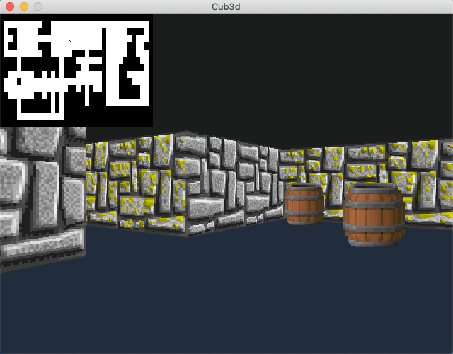
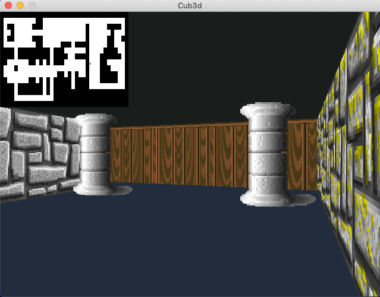

# 42Cub3d - @42Born2Code
__Cub3D__ est un projet de design graphique, utilisant le RayCaster /  __Cub3D__ is a graphic design project, using the RayCaster

## What is the Cub3d ?
__Cub3d__ is an _individual project at 42_ or recode a raycasting game similar to [Wolf3d](https://en.wikipedia.org/wiki/Wolfenstein_3D).

This project explores the technique of ray-casting as well as the use of a graphic library specific to the __42school__ [MinilibX](https://github.com/keuhdall/images_example). The objective is to make a dynamic view within a labyrinth, in
which you will have to find your way.

### keyboard touch :
- WASD to move, ← or → Left/Right directional keys to rotate camera
- ESC to quit
- Textures or colors for each sides (North, South, West, East)
- Sprites
- Minimap
